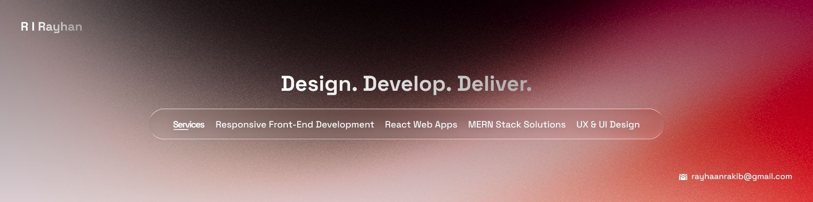

  

 

 

## 👋 About Me

I'm **Rakibul Islam Rayhan**, a full-stack web developer who started on the frontend and has been growing into building complete, production-ready applications end to end.

- 🎨 Started with **React, Tailwind CSS & JavaScript** — now building full-stack products
- 🌱 Currently expanding into **NextJS, TypeScript, PostgreSQL, Prisma, Supabase & OOP**
- 🛠️ Comfortable shipping across the full **MERN stack**, moving into **Next.js**
- 🚀 Focused on real, deployed products — not just tutorial builds
- 🎓 Completing my B.Sc. (results pending)
- 📫 Reach me at **rayhaanrakib@gmail.com**

 

## 🧰 Tech Stack

**Frontend**

**Backend & Database**

**Tools & Platforms**

**CMS & E-commerce**

 

## 🚀 Featured Projects

<strong>🎓 Go Student Classroom</strong>

A classroom management platform that helps teachers create classes, manage students, publish assignments, and streamline online learning.

**Tech Stack:** React • Node.js • Express • MongoDB • Firebase

📦 **Repository:** [View on GitHub](https://github.com/rayhaanrakib/GoStudent-Client)

<strong>🛍️ Sian Boutique</strong>

A modern fashion e-commerce platform with a responsive shopping experience, secure authentication, and online payment integration.

**Tech Stack:** React • Node.js • Express • MongoDB • Stripe

📦 **Repository:** [View on GitHub](https://github.com/rayhaanrakib/Si-an-Boutique)

<strong>🏡 RentNest — Rental Marketplace API</strong>

A scalable backend for a rental marketplace featuring role-based authentication, property management, rental requests, Stripe payments, and a clean Prisma architecture.

**Tech Stack:** TypeScript • Express.js • PostgreSQL • Prisma • Stripe

📦 **Repository:** [View on GitHub](https://github.com/rayhaanrakib/RentNest-Backend-Project)

 

> 💼 **Explore more projects:** **[rayhaanrakib.vercel.app](https://rayhaanrakib.vercel.app)**

 

## 📊 GitHub Stats

 

<picture>
  <source
    media="(prefers-color-scheme: dark)"
    srcset="https://raw.githubusercontent.com/rayhaanrakib/rayhaanrakib/output/github-contribution-grid-snake-dark.svg"
  />
  <source
    media="(prefers-color-scheme: light)"
    srcset="https://raw.githubusercontent.com/rayhaanrakib/rayhaanrakib/output/github-contribution-grid-snake.svg"
  />
  
</picture>

 

